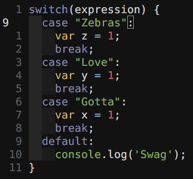

#Sort Blocks By

Now you can sort code blocks in vim such as in switch case statements and anything else that comes to mind.

Installation
------------------------
Compatible with both Pathogen and Vundle.


Usage
-------------------------



To sort a code block, simply highlight a group of code blocks, specify a string as the sorter and then use that string with the :SortBlocksBy function. 

Example (For sorting case blocks in a switch case statement):

```
:'<,'>SortBlocksBy case
```

I created this plugin mainly for sorting switch case statements on larger projects. In theory it should work for other use-cases but not tested. lol.

License
------------------------------------------------------
Distributed under the same terms as Vim itself. See :help license.
